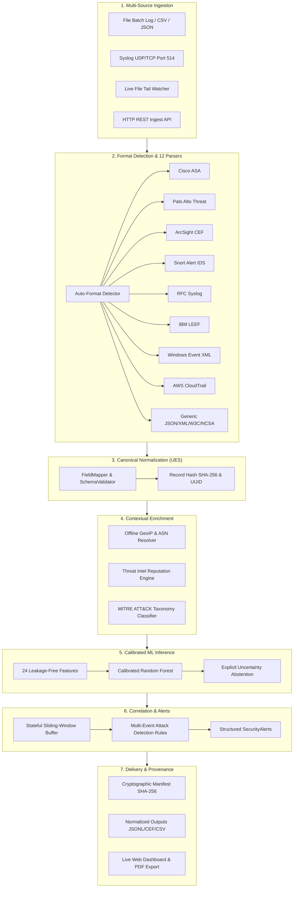

# 🛡️ ULPF — Universal Log Pre-processing Framework
### High-Throughput Perimeter Ingestion, Contextual Enrichment, Calibrated ML Inference & Cryptographic Provenance

[](tests/)
[](https://python.org)
[](#-supported-perimeter-log-formats)
[](#-canonical-unified-event-schema-ues)
[](#-cryptographic-provenance--tamper-detection)
[](LICENSE)

---

## 📖 Executive Summary

Modern Security Operations Centers (SOCs) ingest massive volumes of logs across dozens of disparate perimeter devices, firewalls, cloud platforms, and intrusion detection systems. Analysts face severe **format fragmentation**, **alert fatigue** (over 95% of perimeter traffic is benign noise), and **evidence tampering risks**.

**ULPF (Universal Log Pre-processing Framework)** is an open, modular cybersecurity data engineering pipeline and threat intelligence engine. It auto-detects, parses, canonicalizes, enriches, scores, and correlates perimeter traffic into structured **Unified Event Schema (UES)** records with **sub-millisecond latency**, **calibrated ML uncertainty abstention**, and **cryptographic SHA-256 tamper-evident provenance tracking**.

---

## 🏗️ System Architecture



---

## 📡 Supported Perimeter Log Formats

ULPF provides out-of-the-box support for **12 industry-standard perimeter security formats**:

| Format ID | Origin / Vendor | Category | Sample Pattern | Key Extracted Fields |
|---|---|---|---|---|
| `cisco_asa` | Cisco Systems | Firewall Syslog | `%ASA-3-106023: Deny tcp src outside:198.51.100.44...` | `src_ip`, `dst_ip`, `src_port`, `dst_port`, `event_action` |
| `paloalto_threat` | Palo Alto Networks | Threat / NextGen FW | `1,2024/01/18 10:22:15,001801000001,THREAT,vulnerability...` | `threat_name`, `severity_label`, `threat_signature_id`, `client_ip` |
| `cef` | ArcSight / HP / MicroFocus | Security Standard | `CEF:0\|Vendor\|Product\|Version\|SignatureID\|Name\|Sev\|...` | `event_action`, `src_ip`, `dst_ip`, `severity_label` |
| `snort_alert` | Snort / Cisco Talos | Network NIDS | `[**] [1:2001219:20] ET SCAN Potential SSH Brute Force...` | `threat_name`, `threat_signature_id`, `src_port`, `dst_port` |
| `syslog` | RFC 3164 / 5424 | Linux / Network Syslog | `<134>Jan 18 10:25:01 perimeter-fw01 filterlog[1204]:...` | `timestamp`, `host`, `facility`, `severity_label`, `message` |
| `leef` | IBM QRadar | SIEM Security Standard | `LEEF:1.0\|Cisco\|ASA\|9.14\|106023\|src=198.51.100.60...` | `vendor`, `device_product`, `action`, `src_ip`, `dst_ip` |
| `windows_event_xml` | Microsoft Windows Server | Security Audit (XML) | `<Event><System><EventID>4625</EventID></System>...` | `event_id`, `target_user_name`, `ip_address`, `status_code` |
| `aws_cloudtrail` | Amazon Web Services | Cloud Audit (JSON) | `{"eventSource":"iam.amazonaws.com","eventName":"...` | `user_name`, `event_source`, `source_ip_address`, `error_code` |
| `json` | Generic Application | Modern Microservices | `{"src_ip":"198.51.100.150","dst_port":80,"action":"deny"...}` | Any JSON attributes mapped to canonical UES fields |
| `xml` | Generic Enterprise App | Legacy Web Services | `<log><src_ip>198.51.100.200</src_ip><port>443</port>...` | Any XML tags mapped to canonical UES fields |
| `w3c` | IIS / Squid / Apache W3C | Web Proxy Access | `#Fields: date time c-ip cs-method cs-uri-stem sc-status...` | `client_ip`, `http_method`, `uri_stem`, `http_status` |
| `ncsa_combined` | Nginx / Apache HTTPD | Web Server Access | `198.51.100.12 - - [18/Jan/2024:10:22:15] "GET / HTTP/1.1"...` | `client_ip`, `http_method`, `http_status`, `user_agent` |

---

## 📜 Canonical Unified Event Schema (UES)

Every event normalized by ULPF adheres to the **Unified Event Schema** standard:

```json
{
  "event_uid": "af4954d5-4e01-4086-aeac-7815862560ab",
  "record_hash": "58f8da83a624742a889fe21299770f09",
  "raw_log": "CEF:0|Palo Alto Networks|PAN-OS|10.1|threat|SQL Injection|9|src=198.51.100.10 dst=10.0.0.1 dpt=80 act=drop",
  "format_name": "cef",
  "source_id": "perimeter_edge_01",
  "timestamp": "2026-09-18T09:34:12.967222+00:00",
  "src_ip": "198.51.100.10",
  "dst_ip": "10.0.0.1",
  "dst_port": 80,
  "event_action": "drop",
  "severity_label": "CRITICAL",
  "threat_name": "SQL Injection",
  "threat_intel_score": 0.85,
  "is_malicious": true,
  "mitre_tactic": "Initial Access",
  "mitre_technique_id": "T1190",
  "mitre_technique_name": "Exploit Public-Facing Application",
  "src_country": "US",
  "is_src_private": false,
  "weak_label": "attack",
  "label_confidence": 0.9912,
  "extra_fields": {
    "cef_version": "0",
    "device_product": "PAN-OS"
  }
}
```

---

## ⚡ Quick Start & Installation

### 1. Installation
```bash
# Clone the repository
git clone https://github.com/ayush/PDS-Log-IDS-Project.git
cd PDS-Log-IDS-Project

# Set up virtual environment
python -m venv .venv
source .venv/bin/activate  # On Windows: .\.venv\Scripts\Activate.ps1

# Install dependencies
pip install -r requirements.txt
```

### 2. Verify with Automated Test Suite
```bash
pytest tests/ -v
```
Output:
```text
============================= 152 passed in 4.5s =============================
```

---

## 💻 CLI Reference (`ulpf.py`)

ULPF includes a unified CLI entry point for all pipeline operations:

### 1. Master End-to-End Pipeline
Execute the full 6-stage lifecycle (ingest, parse, enrich, classify, correlate, manifest):
```bash
python ulpf.py pipeline \
  --input data/raw/cisco_asa.log \
  --output outputs/cisco_normalized.jsonl \
  --alerts outputs/cisco_alerts.jsonl \
  --manifest outputs/manifest.json
```
**Flags**:
- `--no-enrich`: Skip GeoIP, Threat Intel, and MITRE ATT&CK enrichment.
- `--no-classify`: Skip ML classifier inference.
- `--no-correlate`: Skip stateful sliding-window correlation.
- `--output-format jsonl|cef|csv`: Select output serialization format.
- `--max-events <N>`: Limit batch processing to N events.

### 2. Cryptographic Provenance Verification
Audit files on disk against an existing manifest to detect any tampering:
```bash
python ulpf.py verify-manifest --manifest outputs/manifest.json
```

### 3. Live Stream Listeners
Ingest live streams from network perimeter hardware:
```bash
# Syslog Listener (UDP/TCP Port 514)
python ulpf.py listen --mode syslog --port 514 --protocol udp

# File Tail Watcher (detects rotation automatically)
python ulpf.py listen --mode file --file /var/log/firewall.log

# HTTP REST Receiver
python ulpf.py listen --mode rest --port 8080
```

### 4. Interactive Live Web Dashboard
Launch the zero-dependency visualization server:
```bash
python ulpf.py demo --port 7000
```
Then navigate to `http://localhost:7000`.

### 5. Machine Learning Classifier
Train or evaluate the calibrated Random Forest model:
```bash
# Train calibrated model
python ulpf.py train --input data/processed/cleaned_events.jsonl --output models/calibrated_rf.joblib

# Evaluate model metrics and confusion matrix
python ulpf.py evaluate --model models/calibrated_rf.joblib --test-data data/processed/test_split.jsonl
```

---

## 📊 Live Interactive Console & REST API

The live dashboard (`demo/server.py`) is built using Python's standard library (zero external web frameworks) and provides:

- **One-Click Test Presets**: Test Palo Alto Threat, Cisco ASA, CEF, Snort IDS, LEEF, Windows Event XML, and CloudTrail with one click.
- **Zero-Noise Filtering**: Defaults to isolated security threats, with instant toggling to baseline network traffic.
- **Live Search & Filter**: Sub-millisecond client-side filtering across IPs, event actions, signatures, and MITRE techniques.
- **Executive PDF Threat Report**: Download professional landscape A4 threat briefings directly from the browser.

### REST Endpoints
- `POST /api/process`: Ingest and normalize raw log text, returning canonical UES events with threat isolation.
- `GET /api/stats`: Fetch real-time telemetry (EPS, threat count, benign baseline count, format distribution).
- `GET /api/events`: Query the circular in-memory buffer of normalized events.
- `GET /api/events/stream`: Real-time Server-Sent Events (SSE) live feed.

---

## 🔒 Cryptographic Provenance & Tamper Detection

To ensure forensic defensibility in security audits, ULPF computes SHA-256 digests for all inputs, outputs, and alerts:

```json
{
  "manifest_version": "ulpf-provenance-v1.0",
  "execution_id": "0d9990b7-695c-436f-b2b5-ddb88fc704cb",
  "timestamp": "2026-09-18T09:30:15Z",
  "input_files": {
    "data/raw/cisco_asa.log": {
      "sha256": "4b5d6...",
      "size_bytes": 1048576,
      "format_detected": "cisco_asa"
    }
  },
  "output_files": {
    "outputs/cisco_normalized.jsonl": {
      "sha256": "8a3e1...",
      "size_bytes": 2049582,
      "record_count": 10000
    }
  }
}
```
If an adversary or insider alters a single character in an archived log file, `ulpf.py verify-manifest` flags the exact corrupted file immediately.

---

## 📚 Academic Practicals Curriculum (1 Through 10)

This repository fulfills the complete 10-part advanced security log engineering curriculum:

| Practical | Title | Implementation Artifacts |
|---|---|---|
| **Practical 1** | Streaming Log Exploration & Quality Assessment | `src/analysis/`, `notebooks/practical_01_exploration.ipynb` |
| **Practical 2** | Event Structuring & Record Hashing | `src/structuring/`, `notebooks/practical_02_structuring.ipynb` |
| **Practical 3** | Conservative Cleaning & RFC Schema Validation | `src/cleaning/`, `notebooks/practical_03_cleaning.ipynb` |
| **Practical 4** | Confidence-Aware Weak Labeling | `src/labeling/`, `notebooks/practical_04_weak_labeling.ipynb` |
| **Practical 5** | Causal Leakage-Free Feature Engineering | `src/features/`, `notebooks/practical_05_features.ipynb` |
| **Practical 6** | Stratified Splits & Temporal Partitioning | `src/evaluation/`, `notebooks/practical_06_splits.ipynb` |
| **Practical 7** | Multi-Format Ingestion & Dynamic Parsers | `src/ingestion/`, `configs/sources/` |
| **Practical 8** | Contextual Security Enrichment & MITRE Mapping | `src/enrichment/`, `configs/enrichment.yaml` |
| **Practical 9** | Calibrated Classifier Training & Inference | `src/models/`, `notebooks/practical_09_classification.ipynb` |
| **Practical 10** | End-to-End Pipeline & Cryptographic Provenance | `src/pipeline.py`, `notebooks/practical_10_pipeline.ipynb` |

---

## 🧪 Test Suite Summary

The framework contains 152 automated tests spanning all subsystems:
- `tests/test_parsers.py`: 75 tests covering all 12 formats and boundary cases.
- `tests/test_enrichment.py`: 16 tests covering GeoIP routing, threat reputation, and MITRE mapping.
- `tests/test_correlation.py`: 10 tests covering sliding-window correlation and alert generation.
- `tests/test_classifier.py`: 12 tests covering feature extraction, calibrated inference, and uncertainty abstention.
- `tests/test_e2e_pipeline.py`: 9 tests covering end-to-end execution, provenance manifests, and tamper detection.
- Additional test modules covering structuring, cleaning, labeling, and feature extraction.

```bash
pytest tests/ -v
```

---

## 📁 Repository Structure

```text
PDS-Log-IDS-Project/
├── configs/                  # YAML configurations (enrichment, correlation, sources)
│   ├── correlation_rules.yaml
│   ├── enrichment.yaml
│   └── sources/              # 12 perimeter source field mapping configurations
├── data/                     # Data directory (raw, processed, samples)
│   ├── raw/
│   └── samples/
├── demo/                     # Live Web Dashboard
│   ├── demo_data_generator.py # Realistic perimeter traffic simulator
│   ├── index.html            # Single-page executive operations console
│   └── server.py             # Pure Python stdlib HTTP/SSE server (zero external web deps)
├── docs/                     # System Documentation
│   ├── SETUP.md              # Installation and setup guide
│   ├── architecture.md       # Detailed technical architecture
│   ├── demo_script.md        # 5-minute live demo script for judges
│   └── sih_presentation.md   # Presentation deck outline and evaluation criteria
├── models/                   # Serialized ML models and scaler artifacts
├── notebooks/                # Academic curriculum notebooks (Practicals 1 to 10)
├── outputs/                  # Pipeline outputs, alerts, and provenance manifests
├── src/                      # Source Code
│   ├── correlation/          # Stateful sliding-window correlation engine
│   ├── enrichment/           # GeoIP, Threat Intel, and MITRE ATT&CK mappers
│   ├── ingestion/            # 12 perimeter parsers, registry, and auto-detector
│   ├── models/               # ML feature extractor, train, inference, evaluation
│   ├── schema/               # UnifiedEvent schema, FieldMapper, SchemaValidator
│   ├── pipeline.py           # Master end-to-end orchestration pipeline
│   └── provenance.py         # Cryptographic SHA-256 manifest engine
├── tests/                    # Automated test suite (152 tests)
├── requirements.txt          # Pinned production & testing dependencies
├── ulpf.py                   # Master CLI entry point
└── README.md                 # Project README
```

---

## 📄 License

This project is licensed under the MIT License — see the [LICENSE](LICENSE) file for details.
